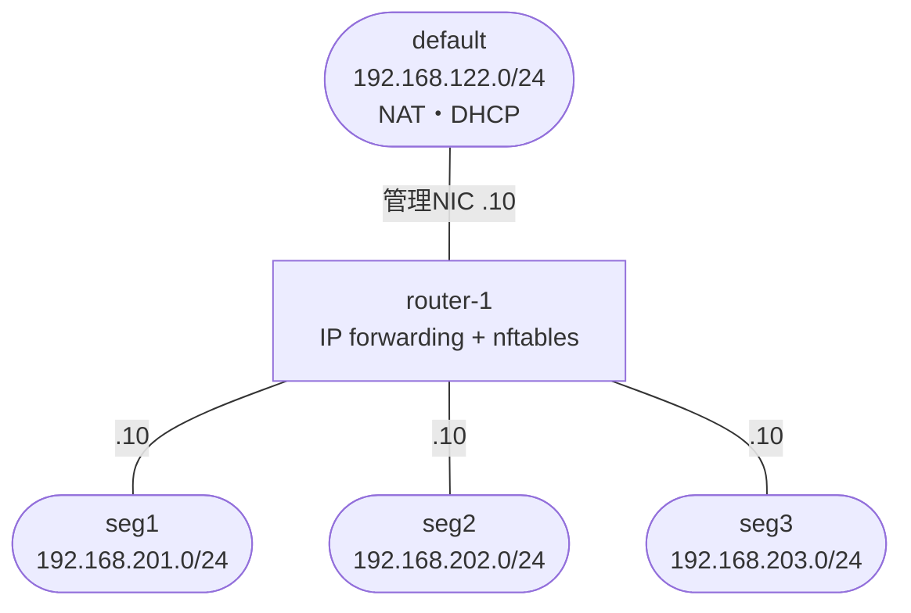

# minivps-router-appliance

[mini-vps-platform](https://github.com/0x69d/mini-vps-platform)上で、複数セグメント間のルーティングを行うルータアプライアンスVM用のゴールデンイメージ・VM spec・ゲスト内設定一式。

## これは何のためのリポジトリか

mini-vps-platformの`seg1`〜`seg3`(192.168.201〜203.0/24)は、それぞれ独立したlibvirt NATネットワークとして分離されており、セグメント間には直接の疎通経路が無い。

本リポジトリは、`seg1`〜`seg3`すべてに直接NICを持ち、ゲスト内でIP forwarding + nftablesによるファイアウォールを行う「ルータVM」を、mini-vps-platformの機能だけで実現する。

## 前提条件

- mini-vps-platformがセットアップ済み(`~/.ssh/minivps_ed25519.pub`公開鍵、`seg1`〜`seg3`ネットワーク、`images`ストレージプール、`ubuntu-26.04.img`が`images`プールに存在すること)
- セグメントは mini-vps-platform の既定では作られない。`ansible/vars/network_segments.yml` で定義して playbook を実行する(同ファイルに3セグメント構成の例をコメントで同梱)。

## アーキテクチャ



| ネットワーク | CIDR | router-1のIP | 用途 |
|---|---|---|---|
| default | 192.168.122.0/24 | 192.168.122.10 | 管理(SSH) |
| seg1 | 192.168.201.0/24 | 192.168.201.10 | ルーティング対象 |
| seg2 | 192.168.202.0/24 | 192.168.202.10 | ルーティング対象 |
| seg3 | 192.168.203.0/24 | 192.168.203.10 | ルーティング対象 |

セグメント間の通信可否は、router-1のゲスト内nftablesが制御する。既定ではすべてのセグメント間通信が拒否される。

## クイックスタート

1. ゴールデンイメージをビルドする:
   ```bash
   ./build/build-golden-image.sh
   ```
   完了すると `images` プールに `minivps-router-golden-YYYYMMDD.qcow2` という名前で配置される。出力メッセージで実際のファイル名を確認する。

2. `specs/router-1.yaml` の `base_image` を、ビルドで得られたファイル名に書き換える。

3. VMを作成する(mini-vps-platform側で):
   ```bash
   uv run mini-vps create /path/to/minivps-router-appliance/specs/router-1.yaml
   ```

4. 管理アクセスを確認する:
   ```bash
   uv run mini-vps status router-1   # ip: 192.168.122.10 が返る
   ssh -i ~/.ssh/minivps_ed25519 ubuntu@192.168.122.10
   ```

## nftablesの運用

許可リストは `/etc/nftables.d/90-segment-allow.conf` に運用者が追記する。サンプルをコメントアウト済みで同梱。

```bash
# router-1にSSHして編集
sudo vi /etc/nftables.d/90-segment-allow.conf
# 例: seg1 -> seg2 を全許可する
#   add rule inet filter forward ip saddr 192.168.201.0/24 ip daddr 192.168.202.0/24 accept

# 必ずメインファイル経由でreloadする(90-segment-allow.conf単体をnft -fすると
# add ruleが無条件追記され、再読込のたびに重複するため)
sudo systemctl reload nftables
```

## 他のVM側の設定

`seg1`にいるVMから`seg2`へ到達させるには、mini-vps-platform既存の`static_routes`機能でrouter-1経由の経路を宣言する:

```yaml
# seg1側のVMの例
networks: [seg1]
static_routes:
  - destination: 192.168.202.0/24
    via: 192.168.201.10   # router-1 の seg1 側IP
```

対称的に、`seg2`側のVMには`destination: 192.168.201.0/24, via: 192.168.202.10`を設定する。

これだけでは経路が通っても、router-1側の許可リストにルールを追加しない限りforward chainの既定拒否で通信が止まる点に注意。

## トラブルシューティング

- ビルドがタイムアウトした場合: `virsh console <ビルドVM名>` でシリアルコンソールに接続して調査する。ビルド用ドメインはtransientで、シャットダウンと同時に消滅する点に注意。
- `mini-vps status`が管理IP以外を返す場合: `specs/router-1.yaml`の`networks`の並び順(`default`が先頭かつ静的IPになっているか)を確認する。
